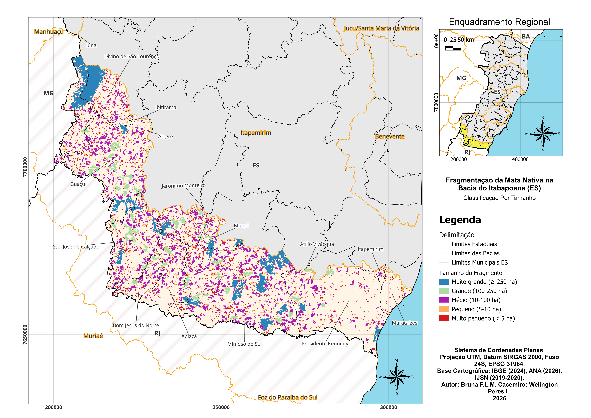
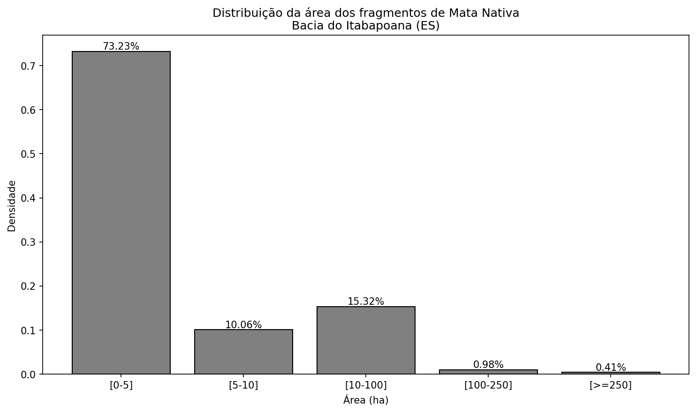
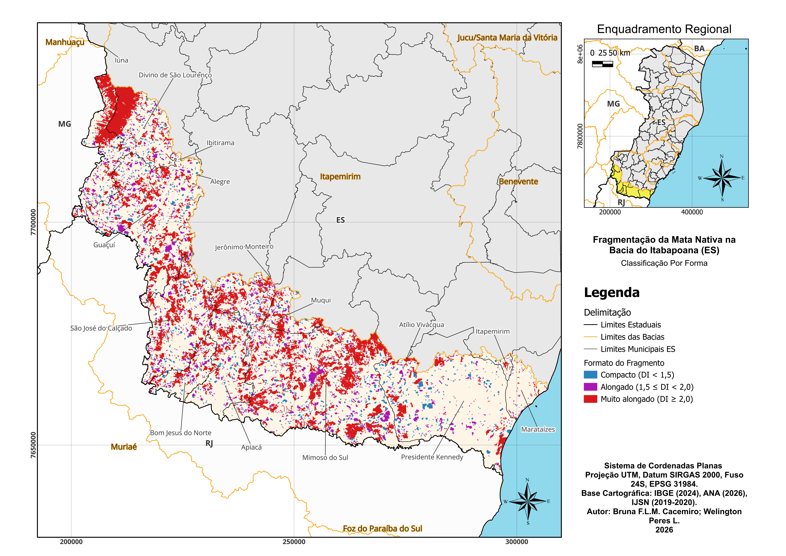
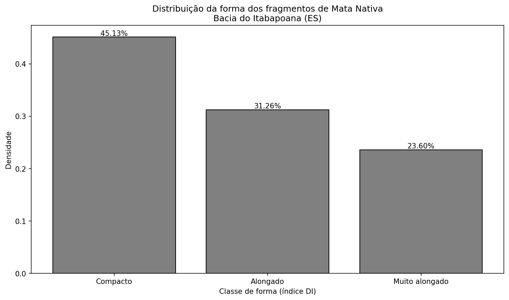
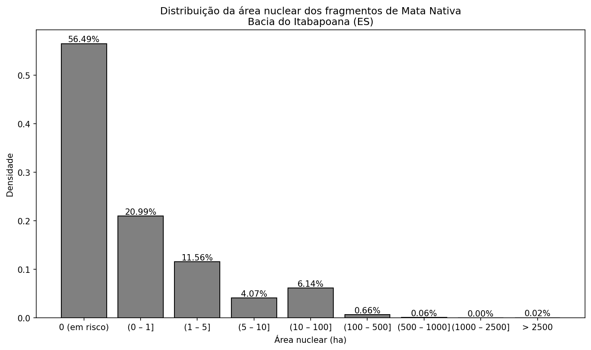
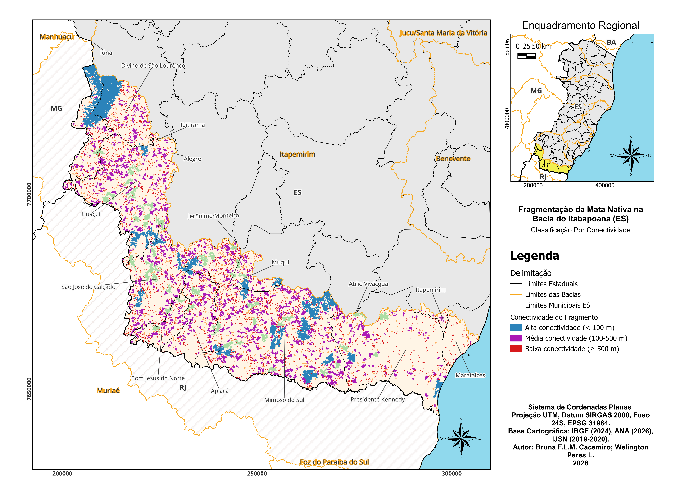
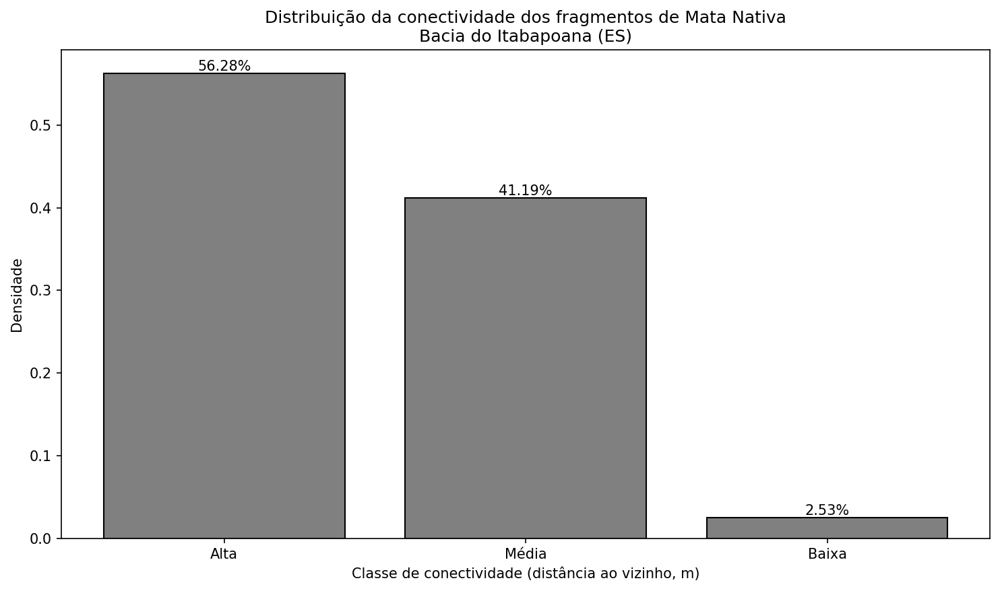

# Ecologia da Paisagem - Bacia do Itabapoana (ES)

Análise de fragmentos de Mata Nativa e Mata Nativa em Estágio Inicial de Regeneração na Bacia do Itabapoana, Espírito Santo.

## Introdução

A Bacia do Itabapoana divide território entre Espírito Santo e Rio de Janeiro, no domínio da Mata Atlântica. O bioma perdeu a maior parte da cobertura original. Ribeiro et al. (2009) estimam que restam menos de 8% do que existia. Com a fragmentação, o que importa não é só quanto resta de floresta, mas como os remanescentes se distribuem no espaço. O tamanho de cada fragmento, sua forma e a distância entre eles passam a definir o que ainda pode persistir. Forman e Godron (1986) já destacavam esse papel da estrutura da paisagem.

A maior parte dos fragmentos da Mata Atlântica tem menos de 50 ha. Ribeiro et al. (2009) chegaram a esse resultado em escala nacional. Em bacias do Espírito Santo, estudos como o de Pirovani et al. (2014) na Bacia do Itapemirim e o de Santos et al. (2015) apontam na mesma direção. A maior parte dos remanescentes é pequena. Fragmentos nessa faixa costumam abrigar menos espécies do que um trecho florestal contínuo de área equivalente, já que a proporção de borda em relação ao núcleo tende a ser maior.

A distância entre fragmentos também conta. Quanto mais isolado um remanescente, menor a chance de troca de indivíduos e genes com outros fragmentos. Martensen et al. (2012) mostraram que a conectividade está ligada à riqueza de aves de sotobosque. Mello et al. (2016) e Souza et al. (2014) usam métricas de conectividade para indicar onde vale a pena priorizar ações de conservação.

A forma do fragmento entra na conta. Fragmentos alongados têm mais perímetro em relação à área. Patton (1975) propôs um índice que junta perímetro e área para quantificar isso. Quando o fragmento é alongado, a borda ganha peso e o núcleo diminui, o que reduz a qualidade do habitat. Forman e Godron (1986) discutem esse efeito em detalhe.

> **NOTE**  
> Este projeto trabalha com os fragmentos de **Mata Nativa** e **Mata Nativa em Estágio Inicial de Regeneração** na parte capixaba da bacia. Os dados vêm do mapeamento de uso do solo do IJSN (2019-2020). As métricas seguem a literatura citada em [docs/referencias.md](docs/referencias.md).

## Objetivo

O presente trabalho tem por objetivo **caracterizar a estrutura da paisagem florestal** dos fragmentos de Mata Nativa e Mata Nativa em Estágio Inicial de Regeneração na porção capixaba da Bacia do Itabapoana. Para tanto, propõe-se: 

- Calcular métricas de fragmentação florestal (área, perímetro, índice de forma, área nuclear e isolamento); 
- Classificar os fragmentos em classes de tamanho, forma e conectividade estrutural, com base em critérios da literatura; 
- Organizar os resultados em mapas temáticos e análises estatísticas passíveis de uso em relatórios e em estudos de priorização para conservação.

## Metodologia

### Fluxo de processamento

O trabalho foi organizado em 22 etapas, das quais 20 estão concluídas. O fluxo divide-se em quatro blocos:

1. **Aquisição e preparação** (Etapas 1-7): Estruturação do repositório, obtenção das bases (IBGE, ANA, IJSN), extração da bacia do Itabapoana, recorte do uso e cobertura do solo e seleção das classes Mata Nativa e Mata Nativa em Estágio Inicial de Regeneração.
2. **Processamento vetorial** (Etapas 8-9): Unificação das duas classes em um único conjunto de polígonos (dissolve e explosão em partes simples) e correção topológica por fechamento morfológico (buffer ±0,5 m) para eliminar frestas artificiais da vetorização.
3. **Métricas e classificações** (Etapas 10-17): Cálculo de área, perímetro, índice de forma, área nuclear (buffer negativo 50 m), isolamento (distância ao vizinho mais próximo), classificação por tamanho, forma e conectividade, e atribuição do município a cada fragmento.
4. **Visualização e síntese** (Etapas 18-20): Histogramas de área, forma, conectividade e área nuclear (frequência e densidade), estilização das camadas por essas classificações no QGIS e produção dos mapas temáticos com legenda, escala e norte.

> **NOTE**  
> As etapas 21 e 22 (análises por município e por sub-bacia) estão planejadas e descritas em [docs/Procedimentos/procedimentos.md](docs/Procedimentos/procedimentos.md).

### Tecnologias e fontes de dados

| Item | Especificação |
|------|---------------|
| **SIG** | QGIS (versão 3.16 ou superior recomendada) |
| **CRS** | SIRGAS 2000 / UTM zone 24S (EPSG:31984) |
| **Formato de saída** | GeoPackage (.gpkg) |
| **Fontes** | IBGE (malhas municipais e UFs), ANA/SNIRH (bacias hidrográficas), IJSN/Geobases (uso e cobertura do solo ES 2019-2020) |

> **NOTE**  
> As camadas foram reprojetadas para UTM 24S antes das análises. As métricas foram calculadas na Calculadora de campos do QGIS, com funções como `overlay_nearest` para o isolamento e `overlay_intersects` para a atribuição de município. Detalhes das fontes em [docs/fontes-dados.md](docs/fontes-dados.md).

### Critérios metodológicos

**Área Mínima Mapeável (AMM):** 0,5 ha. Fragmentos menores foram excluídos após a correção topológica, com base em Rutchey et al. (2008), Wickham et al. (2004) e Mello et al. (2016).

**Correção topológica:** Fechamento morfológico (buffer +0,5 m, dissolve, buffer −0,5 m) para eliminar frestas artificiais da vetorização, sem unir fragmentos separados por estradas reais (Mader, 1984; Forman, 1997).

**Precisão numérica:** Quatro casas decimais no banco espacial; duas casas na apresentação dos resultados.

### Classificações adotadas

**Tamanho** (Fernandes & Fernandes, 2017; Santos et al., 2015):

| Classe        | Área (ha) |
|---------------|-----------|
| Muito pequeno | &lt; 5    |
| Pequeno       | 5–10      |
| Médio         | 10–100    |
| Grande        | 100–250   |
| Muito grande  | ≥ 250     |

**Forma** (Patton, 1975). Índice DI = P / (2√πA):

| Classe         | Faixa do índice |
|----------------|-----------------|
| Compacto       | DI &lt; 1,5     |
| Alongado       | 1,5 ≤ DI &lt; 2,0 |
| Muito alongado | DI ≥ 2,0        |

**Conectividade** (Ribeiro et al., 2009; Martensen et al., 2012; Mello et al., 2016). Baseada na distância ao vizinho mais próximo:

| Classe              | Distância (m) |
|---------------------|---------------|
| Alta conectividade  | &lt; 100      |
| Média conectividade | 100–500       |
| Baixa conectividade | ≥ 500         |

**Outras métricas:** Área nuclear (buffer negativo de 50 m a partir do perímetro) e isolamento (distância borda a borda ao fragmento mais próximo).

## Resultados Obtidos

As análises consideraram os fragmentos de Mata Nativa e Mata em Estágio Inicial de Regeneração na porção capixaba da Bacia do Itabapoana, após a aplicação da Área Mínima Mapeável (AMM) de 0,5 ha. Foram analisadas 5.383 feições. A seguir, os resultados são apresentados e discutidos por dimensão: tamanho, forma, área nuclear e conectividade.

### Tamanho

A distribuição dos fragmentos por classe de área (Fernandes & Fernandes, 2017; Santos et al., 2015) confirma o padrão já observado em escala nacional por Ribeiro et al. (2009): a maior parte dos remanescentes concentra-se nas classes menores. Na Bacia do Itabapoana (ES), a maior proporção de feições encontra-se nas faixas de muito pequeno (&lt; 5 ha) e pequeno (5–10 ha). Fragmentos nessa faixa apresentam maior relação borda/núcleo e costumam abrigar menos espécies que um trecho contínuo de área equivalente (Forman & Godron, 1986). O mapa por tamanho e o histograma de densidade permitem visualizar essa concentração e a escassez de fragmentos nas classes grande (100–250 ha) e muito grande (≥ 250 ha).

**Mapa: fragmentos por tamanho**



O mapa evidencia a distribuição espacial das classes de tamanho na bacia: os fragmentos muito pequenos e pequenos predominam em extensas áreas, enquanto os de classe grande e muito grande aparecem de forma esparsa. A seguir, o histograma de densidade resume em termos proporcionais essa distribuição, reforçando a concentração nas faixas inferiores a 10 ha.

**Histograma (densidade): área (ha)**



---

### Forma

A forma dos fragmentos foi quantificada pelo índice de Patton (1975) (DI = P / 2√πA). Valores próximos de 1 indicam forma circular; quanto maior o índice, maior a relação perímetro/área e a exposição a efeitos de borda. Forman e Godron (1986) destacam que fragmentos alongados ou irregulares tendem a ter menor área de núcleo em relação à borda, o que reduz a qualidade do habitat. Na área de estudo, a distribuição por classes (Compacto, Alongado, Muito alongado) mostra a proporção de fragmentos em cada faixa e espacialmente onde predominam formas mais alongadas. O mapa e o histograma de densidade ilustram esse resultado.

**Mapa: fragmentos por forma**



A distribuição espacial das classes de forma (Compacto, Alongado, Muito alongado) permite identificar setores da bacia em que predominam fragmentos mais alongados ou mais compactos. Em complemento, o histograma de densidade quantifica a proporção de fragmentos em cada classe, facilitando a leitura das magnitudes relativas.

**Histograma (densidade): índice de forma**



---

### Área nuclear (core)

A área nuclear foi obtida por buffer negativo de 50 m a partir do perímetro, removendo a zona de influência da borda. Fragmentos com área nuclear igual a zero (classe "0 em risco") não possuem núcleo livre de efeito de borda e são especialmente vulneráveis. A distribuição por classes (0; 0–1 ha; 1–5 ha; …; &gt; 2500 ha) evidencia quantos fragmentos se enquadram em cada faixa e a proporção em risco. Mello et al. (2016) e a literatura de ecologia de borda (ex.: largura de penetração de 50 m) embasam a interpretação. 

**Histograma (densidade): área nuclear (ha)**



---

### Conectividade

A conectividade estrutural foi classificada com base na distância ao vizinho mais próximo (Ribeiro et al., 2009; Martensen et al., 2012; Mello et al., 2016). Quanto menor a distância, maior a conectividade e o potencial de fluxo de espécies entre fragmentos. Martensen et al. (2012) associaram a conectividade à riqueza de aves de sotobosque; Mello et al. (2016) e Souza et al. (2014) usam a métrica para priorização espacial. Na bacia, a distribuição entre as classes (Alta, Média, Baixa) mostra a proporção de fragmentos bem conectados ou isolados. O mapa e o histograma de densidade permitem localizar espacialmente e em termos proporcionais esse padrão.

**Mapa: fragmentos por conectividade**



No mapa, as áreas de alta conectividade concentram-se onde os fragmentos estão mais próximos; as de baixa conectividade coincidem com trechos mais isolados na paisagem. O histograma de densidade, a seguir, apresenta a proporção de fragmentos em cada classe de conectividade, permitindo avaliar o peso relativo dos fragmentos bem conectados em relação aos isolados.

**Histograma (densidade): conectividade (distância ao vizinho, m)**



---

> **NOTE**  
> Cada mapa inclui legenda, escala gráfica, norte e demais elementos cartográficos. Versões em PDF e GeoTIFF em `Resultados/Maps/PDF/` e `Resultados/Maps/Img_tif/`. Detalhes da produção em [docs/Procedimentos/procedimentos.md](docs/Procedimentos/procedimentos.md) (Etapas 18 a 20).


## Conclusões

A caracterização da estrutura da paisagem florestal na porção capixaba da Bacia do Itabapoana, com base em 5.383 fragmentos de Mata Nativa e Mata Nativa em Estágio Inicial de Regeneração, confirma o padrão de fragmentação já descrito para a Mata Atlântica. A maior parte dos remanescentes concentra-se nas classes de menor área (muito pequeno e pequeno), em linha com os resultados de Ribeiro et al. (2009) em escala nacional e com estudos em bacias do Espírito Santo (Pirovani et al., 2014; Santos et al., 2015). Essa predominância de fragmentos pequenos implica maior exposição à borda e menor área de núcleo em relação ao total, com consequências para a persistência de espécies sensíveis (Forman & Godron, 1986).

A distribuição por forma (índice de Patton) e por conectividade (distância ao vizinho mais próximo) permite identificar setores da bacia em que os fragmentos são mais alongados ou mais isolados, informações úteis para priorização espacial (Martensen et al., 2012; Mello et al., 2016; Souza et al., 2014). A parcela de fragmentos com área nuclear nula evidencia aqueles em que não há núcleo livre de efeito de borda, reforçando a necessidade de olhar não só a área total, mas a qualidade do habitat remanescente.

Em conjunto, os mapas temáticos e os histogramas de densidade oferecem uma síntese reprodutível da estrutura da paisagem na bacia, passível de uso em relatórios, em comparações com outras unidades hidrográficas e em etapas posteriores de análise por município ou por sub-bacia. O trabalho contribui assim para a base de conhecimento sobre a fragmentação florestal na Bacia do Itabapoana e para a definição de prioridades de conservação e restauração no domínio da Mata Atlântica no Espírito Santo.

# Uso do Projeto

## Reproducibilidade

O roteiro completo está documentado em [docs/Procedimentos/procedimentos.md](docs/Procedimentos/procedimentos.md), com ferramentas, parâmetros e expressões do QGIS. Cada etapa indica origem, destino e critérios adotados. A convenção de nomenclatura dos arquivos está em [docs/nomenclatura.md](docs/nomenclatura.md).

## Como usar

1. **Obter os dados:** Baixe as bases conforme [docs/fontes-dados.md](docs/fontes-dados.md) e organize em `Projeto/Dados/`.
2. **Configurar Git LFS:** Se for versionar dados GIS, execute `git lfs install` e tracke os tipos `.gpkg`, `.shp`, `.shx`, `.dbf`, `.prj`, `.tif`.
3. **Seguir o roteiro:** Abra o QGIS e execute as etapas em [docs/Procedimentos/procedimentos.md](docs/Procedimentos/procedimentos.md).

## Estrutura do repositório

```
Ecologia_Paisagem/
├── data/                   Dados tabulares (ex.: CSV exportado dos fragmentos)
├── docs/
│   ├── Procedimentos/       Roteiro e procedimentos (QGIS), imagens
│   ├── fontes-dados.md      Catálogo de fontes
│   ├── nomenclatura.md      Convenção de nomes
│   └── referencias.md       Citações bibliográficas
├── Resultados/
│   ├── Histogramas/         Histogramas (área, forma, conectividade, área nuclear)
│   └── Maps/                Mapas temáticos (tamanho, forma, conectividade)
├── scripts/
│   └── AnaliseEstatistica/
│       └── Histograma/      Scripts Python dos histogramas
└── Projeto/
    └── Dados/               Dados geográficos
        ├── Dados_Brutos/        Camadas baixadas (IBGE, ANA, IJSN)
        │   ├── BaciasHidrograficas_Completo/
        │   ├── BR_UF_2024_Completo/
        │   ├── ES_Municipios_2024_Completo/
        │   └── ijsn_mapeamento_uso_solo_2019_2020/
        ├── Recortes_Bacia/      Recortes na área da bacia do Itabapoana
        │   ├── Bacia_BH_Itabapoana_AreaEstudo/
        │   ├── MataNativa_BH_Itabapoana_ES_Extracao/
        │   └── UsoSolo_BH_Itabapoana_ES_Recorte/
        └── Fragmentos_Analise/  Camada principal com métricas
            └── Fragmentos_MataNativa_BH_I_ES.gpkg
```

## Documentação

| Documento | Descrição |
|-----------|-----------|
| [docs/Procedimentos/procedimentos.md](docs/Procedimentos/procedimentos.md) | Roteiro completo, etapas 1–22, expressões QGIS |
| [docs/fontes-dados.md](docs/fontes-dados.md) | Fontes de dados (IBGE, ANA, IJSN) e links |
| [docs/nomenclatura.md](docs/nomenclatura.md) | Convenção de nomes para arquivos e camadas |
| [docs/referencias.md](docs/referencias.md) | Referências bibliográficas |

## Dados

Os dados geográficos ficam em `Projeto/Dados/`. Se não estiverem no repositório (por tamanho ou por não terem sido commitados), obtenha conforme [docs/fontes-dados.md](docs/fontes-dados.md) e organize nessa pasta.

## Citação

Se usar este projeto em pesquisa ou relatórios, cite-o. Os mapas e resultados foram elaborados por **Bruna F.L.M. Cacemiro** e **Welington Peres L.** (2026). Citação sugerida:

> CACEMIRO, B. F. L. M.; PERES, W. (2026). Ecologia da Paisagem - Bacia do Itabapoana (ES). Análise de fragmentos de Mata Nativa na Bacia do Itabapoana, Espírito Santo. Disponível em: [URL do repositório]. Acesso em: [data].

## Licença

A definir. Sugestões: MIT para código; CC-BY 4.0 para dados e documentação. Consulte o repositório para a licença vigente.
